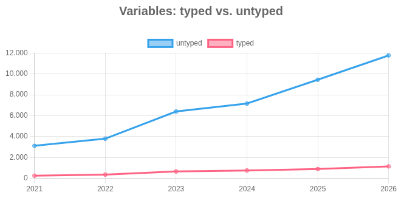

# Explorando evolução de código

Neste exercício, iremos explorar a evolução de código em sistemas reais.

Iremos utilizar a ferramenta [GitEvo](https://github.com/andrehora/gitevo).
Essa ferramenta analisa a evolução de código em repositórios Git nas linguagens Python, JavaScript, TypeScript e Java, e gera relatórios `HTML` como [este](https://andrehora.github.io/gitevo-examples/python/pandas.html).

Mais exemplos de relatórios podem ser podem ser encontrados em https://github.com/andrehora/gitevo-examples.

# Passo 1: Selecionar repositório a ser analisado

Selecione um repositório relevante na linguagem de sua preferência (Python, JavaScript, TypeScript ou Java).
Você pode encontrar projetos interessantes nos links abaixo:

- Python: https://github.com/topics/python?l=python
- JavaScript: https://github.com/topics/javascript?l=javascript
- TypeScript: https://github.com/topics/typescript?l=typescript
- Java: https://github.com/topics/java?l=java

# Passo 2: Instalar e rodar a ferramenta GitEvo

> [!NOTE]
> Antes de instalar a ferramenta, é recomendado criar e ativar um [ambiente virtual Python](https://packaging.python.org/en/latest/guides/installing-using-pip-and-virtual-environments/#create-and-use-virtual-environments).

Instale a ferramenta [GitEvo](https://github.com/andrehora/gitevo) com o comando:

```
$ pip install gitevo
```

Execute a ferramenta no repositório selecionado utilizando o comando abaixo (ajuste conforme a linguagem do repositório).
Substitua `<git_url>` pela URL do repositório que será analisado:

```shell
# Python
$ gitevo -r python <git_url>

# JavaScript
$ gitevo -r javascript <git_url>

# TypeScript
$ gitevo -r typescript <git_url>

# Java
$ gitevo -r java <git_url>
```

Por exemplo, para analisar o projeto Flask escrito em Python:

```
$ gitevo -r python https://github.com/pallets/flask
```

> [!NOTE]
> Essa etapa pode demorar alguns minutos pois o projeto será clonado e analisado localmente.

# Passo 3: Explorar o relatório de evolução de código

Após executar a ferramenta [GitEvo](https://github.com/andrehora/gitevo), é gerado um relatório `HTML` contendo diversos gráficos sobre a evolução do código.

Abra o relatório `HTML` e observe com atenção os gráficos.

# Passo 4: Explicar um gráfico de evolução de código

Selecione um dos gráficos de evolução e explique-o com suas palavras.
Por exemplo, você pode:

- Detalhar a evolução ao longo do tempo
- Detalhar se as curvas estão de acordo com boas práticas
- Explicar grandes alterações nas curvas
- Explorar a documentação do repositório em busca de explicações para grandes alterações
- etc.

Seja criativo!

# Instruções para o exercício

1. Crie um `fork` deste repositório (mais informações sobre forks [aqui](https://docs.github.com/pt/pull-requests/collaborating-with-pull-requests/working-with-forks/fork-a-repo)).
2. Adicione o relatório `HTML` no seu fork.
3. No Moodle, submeta apenas a URL do seu `fork`.

Responda às questões abaixo diretamente neste arquivo `README.md` do seu fork:

1. Repositório selecionado: [https://github.com/prisma/prisma](https://github.com/prisma/prisma)
2. Gráfico selecionado:



3. Explicação: O gráfico que me chamou mais atenção é o de "Variables: typed vs untyped". Ele mostra que o número de variáveis untyped, sem tipagem explícita, explodiu ao longo dos anos, chegando a 12000 declarações em 2026. Já as variáveis typed, com tipagem explícita, não tiveram o crescimento na mesma proporção, mantendo uma certa linearidade. É importante mencionar aqui do que se trata o Prisma. Ele é um ORM, famoso por trazer segurança de tipos para o banco de dados. Por isso, a priori, ver uma dominância de variáveis sem tipagem causa um certo estranhamento. Porém, não é uma má prática. Na verdade, omitir a tipagem explícita em variáveis locais e deixar o compilador deduzir o tipo automaticamente é recomendado pela [documentação](https://www.typescriptlang.org/docs/handbook/2/everyday-types.html#type-annotations-on-variables) oficial do TypeScript. A confiança na inferência segue a linha de manter o código mais limpo e reservar a tipagem explícita apenas para parâmetros e retornos de funções. Se a inferência de tipos não é tão ruim, ainda fica pendente os motivos da explosão da não tipagem nos últimos anos. Isso se deve em boa parte por causa da evolução do motor do TypeScript, que ficou mais inteligente na dedução dos tipos, das ferramentas de padronização (lints), que apagam tipagens explícitas desnecessárias, e do próprio crescimento da ferramenta enquanto utilização.